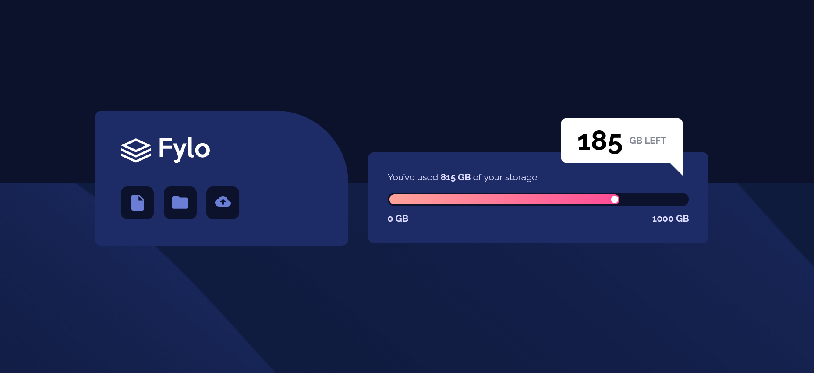

# Frontend Mentor - Fylo data storage component solution

This is a solution to the [Fylo data storage component challenge on Frontend Mentor](https://www.frontendmentor.io/challenges/fylo-data-storage-component-1dZPRbV5n). Frontend Mentor challenges help you improve your coding skills by building realistic projects. 

## Table of contents

- [Overview](#overview)
  - [The challenge](#the-challenge)
  - [Screenshot](#screenshot)
  - [Links](#links)
- [My process](#my-process)
  - [Built with](#built-with)
  - [What I learned](#what-i-learned)
- [Author](#author)
- [Acknowledgments](#acknowledgments)

## Overview

### The challenge

Users should be able to:

- View the optimal layout for the site depending on their device's screen size

### Screenshot



### Links

- Solution URL: [https://github.com/SuperJulia2024/frontendmentor-Fylo-data-storage-component](https://github.com/SuperJulia2024/frontendmentor-Fylo-data-storage-component)
- Live Site URL: [https://superjulia2024.github.io/frontendmentor-Fylo-data-storage-component/](https://superjulia2024.github.io/frontendmentor-Fylo-data-storage-component/)

## My process

### Built with

- Semantic HTML5 markup
- CSS custom properties
- Flexbox
- Mobile-first workflow

### What I learned

To create a trangle in CSS:

```css
.triangle-down {
  width: 0; 
  height: 0; 
  border-top: 20px solid transparent;
  border-bottom: 20px solid transparent; 
  
  border-right:20px solid white; 
}
```

## Author

- Frontend Mentor - [@SuperJulia2024](https://www.frontendmentor.io/profile/SuperJulia2024)

## Acknowledgments

Thanks to ForntEndMentor for this amazing challenge
